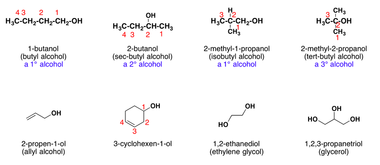

# Organic Chemistry

All organic compounds contain carbon, they usually contain hydrogen and may contain other elements as well.

Millions of organic compounds are known. So we have to make groups and we have to make rules for naming them.

##  Homologous Series

- Homologous series: A group of organic molecules, with similar chemical properties is called homologous series.

- Examples
  - Alkenes: Alkenes Are hydrocarbons which have only single covalent bond in their structure
  - Alkanes: Alkanes are organic compounds that consist entirely of single-bonded carbon and hydrogen atoms and lack any other functional groups. The distinguishing feature of an alkane, making it distinct from other compounds that also exclusively contain carbon and hydrogen, is its lack of unsaturation.
  - Alcohols: All alcohols have an -OH group and --OH
  - Carboxylic acids: Carboxylic acid has an -COOH group

- Empirical formulae: It is the simplest ratio of molecules in an atom.

## Characteristics of a homologous series:

  - All members have the same general formula.
  - They have very similar chemical properties because they are of a same functional group.
  - The physical properties change in a predictable way as the number of carbon atoms increases.
  - Consecutive members in a homologous series differ by a ch2 group.
  - The chain length increases by 1 each time
  - As the chain gets longer, the compounds show a gradual change in properties

## Name of Compounds

Name ending → compound-type name

- “ane” → alkane
- “ene” → alkene
- “ol” → alcohol
- “oic acid” → carboxylic acid
- “yl”, “oate” → ester

### Saturated compounds

> If the compound has a double bond or triple bonds they are known as an unsaturated compound. They do not have the maximum number of hydrogen atoms around the carbon atom.

### Fuctional Groups

> A group of atoms that is responsible for the characteristic reactions of a homologous series.

## Alkanes

What are Alkanes  ?
 > Alkanes are organic compounds that consist entirely of single-bonded carbon and hydrogen atoms and lack any other functional groups. The distinguishing feature of an alkane, making it distinct from other compounds that also exclusively contain carbon and hydrogen, is its lack of unsaturation.
 > CNH2N+2
 > Alkanes are the only have a single covalent bond in their structor. We call then Saturated hydrocarbons, because no more atoms can be added to their molecules.

## Properties of Alkanes (And alkenes)

All alkanes are composed of carbon and hydrogen atoms, and have similar bonds, structures, and formulas. The number of carbon atoms present in an alkane has no limit. Greater numbers of atoms in the molecules will lead to stronger intermolecular attractions and correspondingly different physical properties of the molecules. Properties such as melting point and boiling point (Table below) usually change smoothly and predictably as the number of carbon and hydrogen atoms in the molecules change.

Alkane | Molecular Formula | Melting Point (°C)	| Boiling Point (°C) | Phase at STP4 | Number of Structural Isomers
-------|-------------------|--------------------|--------------------|---------------|-----------------------------
 methane | CH4 | –182.5 | –161.5 | gas | 1
 ethane | C2H6 | –183.3 | –88.6 | gas | 1
 propane | C3H8 | –187.7 | –42.1 | gas | 1
 butane | C4H10 | –138.3 | –0.5 | gas | 2
 pentane | C5H12 | –129.7 | 36.1 | liquid | 3
 hexane | C6H14 | –95.3 | 68.7 | liquid | 5
 heptane | C7H16 | –90.6 | 98.4 | liquid | 9
 octane | C8H18 | –56.8 | 125.7 | liquid | 18
 nonane | C9H2 | –53.6 | 150.8 | liquid | 35
 decane | C10H22 | –29.7 | 174.0 | liquid | 75
 tetradecane | C14H30 | 5.9 | 253.5 | solid | 1858
 octadecane | C18H38 | 28.2 | 316.1 | solid | 60,523

#### Examples of Alkanes

Methane:
```
     H
     |
 H - C - H
     |
     H
```

Ethane:
```
    H 	H
    |	|
H - C - C - H
    |   |
    H   H
```

Propane:
```
    H 	H   H
    |	|   |
H - C - C - C - H
    |   |   |
    H   H   H
```

Butane:
```
    H 	H   H   H
    |	|   |   |
H - C - C - C - C - H
    |   |   |   |
    H   H   H   H
```

Pentane:
Hexane:
Heptane:
Octane:
Nonane:
Decane:


## Alkene

What are alkenes ?
 > An alkene is an unsaturated hydrocarbon that contains a carbon–carbon double bond.

#### Examples of Alkenes
Ethene:
```
H       H
 \     /
  C = C
 /     \
H       H
```
Prophene:
```
    H 	H   H
    |	  |   |
H - C - C = C
    |       |
    H       H
```
Butene:
```
H     H   H   H
 \    |   |   |
  C = C - C - C - H
 /        |   |
H         H   H
```

## Alcohols

Methanol:
```
    H
    |
H - C - O - H
    |
    H
```
Ethanol:
```
    H   H
    |   |
H - C - C - O - H
    |   |
    H   H
```
Propanol:
```
    H   H   H
    |   |   |
H - C - C - C - O - H
    |   |   |
    H   H   H
```
Butanol:
```
    H   H   H   H
    |   |   |   |   
H - C - C - C - C - O - H
    |   |   |   |
    H   H   H   H
```

## Carboxylic Acids

##### General formulae: CnH2n+1COOH

##### Functional group: COOH

```
    H    O
    |   //
H - C - C - O - H
    |       
    H
```

```
H - C = O
    |
    OH     
```

## Structural isomers

> Compounds with same molecular formula but different structural formula are known as structural isomers.

<!-- ## Isomers and Nomenclature

2-methylpropane -->

## Thursday 9th July (Notes)

#### Alkanes are the only hydrocarbon to have a single covalent bond in their structor. We call then Saturated hydrocarbons, because no more atoms can be added to their molecules.


#### Alkanes are generally unreactive but by in certain conditions we can subject alkanes to 2 different types of combustion. Complete and incomplete combustion. With complete combustion it produces carbon dioxide and water . Likewise, with incomplete combustion, It produces carbon monoxide and sut.

#### A photochemical reaction in a chlorine atom replaces a hydrogen atom in the alkane.We call this type of reaction a substitution reaction..

C3H8 + 5 O2 = 3 CO2 + 4 H2O
2 C3H8 + 7 O2 = 6 CO + 8 H2O
C3H8 + 2 O2 = 3 C + 4 H2O

## Fuels

Fuels to know:
    - Coal
    - Natural gas: main constituent is methane
    - Petroleum: a mixture of hydrocarbons which can be separated into fractions

Uses of Petroleum Fractions
 - Refinery gas: bottled gas for heating and cooking
 - Gasoline fraction: fuel (petrol) in cars
 - Naphtha fraction: making chemicals
 - Kerosene/paraffin fraction: jet fuel, lamps
 - Diesel oil/gas oil fraction: fuel in diesel engines
 - Fuel oil fraction: fuel in ships and home heating systems
 - Lubricating fraction: lubricants, waxes and polishes
 - Bitumen: making roads

## Petroleum

There are three types of fossil fuels:
 - Coal
 - petroleum (crude oil)
 - natural gas

### Formation of petroleum
The formation of petroleum (or crude oil) is one of the Earth's major natural resources, the result of a process that began up to 400 million years ago. When prehistoric marine creatures died, they sank to the seabed and were Covered by mud. The change into petroleum and natural gas was brought about by high pressure, high temperature and bacteria acting over millions of years. The original organic material broke down into hydrocarbons. Compression of the mud above the hydrocarbon mixture transformed it into shale. Then geological movements and pressure changed this shale into harder rocks, squeezing out the oil and gas. The oil and gas moved upwards through the porous rocks, moving from high-pressure to low-pressure conditions. Sometimes they reached the surface, but often they became trapped by a layer of non-porous rock.

Reservoirs of oil arid has were created. These reservoirs are not lakes of oil or pockets of gas, instead, the oil or gas is spread throughout the pores in coarse rocks such as sandstone or limestone, in much the same way as water is held in a sponge.

Oilfields and gasfields are detected by a series of geological and seismic surveys. Promising areas are then drilled to gain more geological information or, if oil or gas is found, to see how extensive the old oilfield or gasfield is. Once a field is established production oil rigs can be set up, on land or at sea.


### Fractional distillation

> Fractions: Groups of hydrocarbons that have different boiling points.
> fractionating column: Where separation of the hydrocarbons takes place by fractional distillation.

Fractional distillation Petroleum is the mixture of many different hydrocarbon molecules. Most of the petroleum that is extracted from the ground is used to make fuel, but around 10% is used as a feedstock, or raw materials, in the chemical industry. Before it can be used, the various hydrocarbon molecules are separated by refining. This is done by fractional distillation at an oil refinery.

At a refinery, petroleum is separated into different fractions - groups of hydrocarbons that have different boiling points. These different boiling points are roughly related to the number of carbon atoms in the hydrocarbons.

Separation of the hydrocarbons takes place by fractional distillation using a fractionating column (or tower). At the start of the refining process, petroleum is preheated to a temperature of 350-400 °C and pumped in at the base of the tower. As it boils, the vapor passes up the tower. It passes through a series of bubble caps, and cools as it rises further up the column. The different fractions cool and condense at different temperatures, and therefore at different heights in the column. The fractions condensing at the different levels are collected on trays. Fractions from the top of the tower are called 'light' and those from the bottom 'heavy'. Each fraction contains a number of different hydrocarbons. The individual single hydrocarbons can then be obtained by further distillation.

Petroleum is first introduced to a furnace where the petroleum is first heated. Then all the hydrocarbons turn into gases. Which then the gaseous hydrocarbons are led to a tower called the fractionating column.  

|  Fraction          | Approximate number of carbon atoms in hydrocarbons |           |  State        | Approximate boiling range / C |
|--------------------|----------------------------------------------------|-----------|---------------|-------------------------------|
| refinery gas       | 1 - 4                                              | C1 - C4   |  liquid       | below 25                      |
| gasoline/petrol    | 4 - 12                                             | C4 - C12  |  liquid       | 40 - 100                      |
| naphtha            | 7 - 14                                             | C7 - C14  |  liquid       | 90 - 150                      |
| kerosene/paraffin  | 12 - 16                                            | C9 - C16  |  liquid       | 150 - 240                     |
| diesel oil/gas oil | 14 - 18                                            | C14 - C18 |  liquid       | 220 - 300                     |
| fuel oil           | 19 - 15                                            | C19 - C25 |  liquid       | 250 - 320                     |
| lubricating oil    | 20 - 40                                            | C20 - C40 |  semi-liquid  | 300 - 350                     |
| bitumen            | over 70                                            | > C70     |  semi-liquid  | above 350                     |

> Boiling point and viscosity increases down the group while flammability decreases.

### Natural gas
Natural gas, is a naturally occurring hydrocarbon gas mixture consisting primarily of methane, but commonly including varying amounts of other higher alkanes, and sometimes a small percentage of carbon dioxide, nitrogen, hydrogen sulfide, or helium. It is formed when layers of decomposing plant and animal matter are exposed to intense heat and pressure under the surface of the Earth over millions of years.

### Cracking
> Is the thermal decomposition of alkenes

(in the distillation of petroleum or the like) the process of breaking down certain hydrocarbons into simpler ones of lower boiling points by means of excess heat, distillation under pressure, etc., in order to give a greater yield of low-boiling products than could be obtained by simple distillation.Compare catalytic cracking.

### Reactions of alkenes

https://crab.rutgers.edu/~alroche/Ch08.pdf


### Alkenes Uses

There are several uses of alkenes

Styrofoam Material

The double bond that differentiates between alkanes and alkenes helps in the production of styrofoam. It contributes to create foamy but light texture to the styrofoam. The connection between the atoms are slightly lose and therefore it makes styrofoam a light but flammable material.

Thus, styrofoam of alkenes compound is not recommended for closed space with no fire system suc as soundproof system. It is because the highly flammable material may spark fire and set the room in ablaze in just couple of minutes.

Teflon Coating

Another use of alkenes in industry people can found in teflon. The coating in teflon has polytetrafluorethene in which it also has alkenes in its compound. The coating helps to prevent the teflon to get burned and get the steel damaged in fast time. Thus, it helps to preserve the teflon, the coating for the teflon bottom also helps to stabilize the fire. The coating surely is different from contemporary frying pan that gets burned mark easily compared to teflon.

Artificial Ripening

The use of alkenes that common people may not know is as artificial ripening. The double bond in alkenes help to make the ripening process of fruits faster. Artificial ripening is laboratory processed additive to help farmers not to lose the unripe fruits during harvesting by letting the rest of the fruits ripe using artificial ripening. This chemical may come in liquid and used by spraying it to the fruit. In three days there usually signs of ripening on the fruit.


### Calculation of Empirical Formula

- Step 1: Obtain the mass of each element present in grams
  - Element % = mass in g = m

- Step 2: Determine the number of moles of each type of atom present
  - m/atomic mass = Molar amount (M)

- Step 3: Divide the number of moles of each element by the smallest number of moles
  - M / least M value = Atomic Ratio (R)

- Step 4: Convert numbers to whole numbers. This set of whole numbers are the subscripts in the empirical formula.
  - R * whole number = Empirical Formula


hydrogen can also be produced by cracking. Ethane -> ethene + hydrogen

### Alcohols

Alcohols are one of the most important molecules in organic chemistry. They can be prepared from many different types of compounds, and they can be converted into many different types of compounds. Alcohols are molecules containing the hydroxy functional group (-OH) that is bonded to the carbon atom of an alkyl or substituted alkyl. The hydroxy functional group strongly contributes to the physical properties of alcohols.

#### Nomenclature of Alcohols



### Carboxiylic Acids


